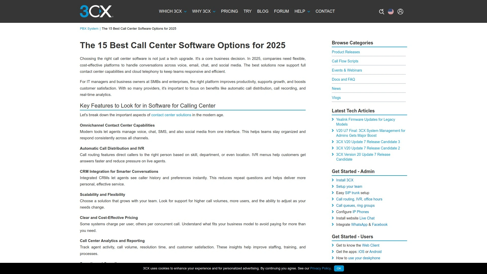

# 10 Most Recommended Free Cloud Call Center Tools in 2025

Running a sales or support team without decent call infrastructure feels like fighting with one hand tied behind your back. You're juggling customer inquiries, tracking conversations across spreadsheets, and losing context every time someone switches devices. Cloud call center platforms solve this mess by centralizing voice calls, SMS, analytics, and CRM integrations into one dashboard accessible from anywhere. Whether you're scaling a startup support team or managing enterprise contact operations, these systems deliver instant setup, AI-powered call routing, real-time transcriptions, and the flexibility to work remotely without losing call quality or customer data.

## **[Aircall](https://aircall.io)**

The ideal choice for teams wanting fast deployment, intuitive interfaces, and seamless CRM connectivity without technical overhead.

Aircall runs entirely in the cloud, eliminating hardware requirements and letting your team start handling calls within minutes of signup. The platform connects with over 100 business tools including Salesforce, HubSpot, Zendesk, Shopify, and Slack, automatically syncing call data across your tech stack. When a customer calls, their information pops up instantly from your CRM, giving agents full context before picking up. Setup involves downloading the desktop or mobile app, selecting phone numbers for your locations, and configuring call flows through the web dashboard.

**AI Voice Agents** handle inbound calls autonomously 24/7, qualifying leads and answering common questions without human intervention. This becomes particularly valuable for small teams that can't staff phones around the clock but need consistent availability. Real-time conversation intelligence provides agents with suggestions during active calls, helping them handle objections or navigate difficult conversations. The system automatically transcribes calls and generates summaries, eliminating manual note-taking that slows down after-call workflows.

Pricing positions Aircall as the most cost-effective call center option compared to enterprise alternatives. WhatsApp integration brings 3 billion users into your communication hub, managing messages alongside traditional calls and SMS. The platform supports unlimited online meetings, shared phone numbers across teams, and detailed analytics tracking metrics like average speed to answer and agent availability. Call recording stores conversations securely in the cloud for training and quality control purposes.

## **[Nextiva](https://www.nextiva.com)**

Best for businesses seeking an all-in-one unified communications platform combining phone, video, chat, and SMS.

Nextiva bundles multiple communication channels into one central hub, letting teams handle voice calls, video conferences, team messaging, and business texting without switching between apps. The platform maintains 99.999% uptime backed by multiple data centers and redundant systems, ensuring calls rarely drop even during peak periods. Automatic failover reroutes calls to alternative numbers or devices whenever internet issues arise, preventing missed customer connections.

The auto attendant uses customizable call flows to route incoming calls professionally, directing customers to appropriate departments based on their needs. Advanced call routing distributes calls intelligently using criteria like agent language capabilities, skill sets, or current availability. Local phone numbers span over 200 area codes across the United States, giving businesses local presence in markets they serve. The mobile app keeps teams connected from anywhere, supporting full functionality including calls, texts, and voicemails on smartphones.

Voicemail transcription converts audio messages into text and emails them directly to users, letting them scan missed calls without listening to each recording. Business SMS works across all cellular carriers, enabling text conversations from business phone lines instead of personal numbers. Video conferencing supports high-quality meetings with screen sharing and collaboration tools. Call recording saves conversations to the cloud for up to six months, valuable for compliance and training purposes. Number porting transfers existing phone numbers at no charge during onboarding.

## **[Dialpad](https://www.dialpad.com)**

Perfect for teams prioritizing AI-powered features like real-time transcription and voice intelligence analytics.

Dialpad built its AI engine in-house rather than licensing third-party technology, resulting in more accurate real-time call transcriptions and keyword detection. The system transcribes conversations as they happen, picking up on specific phrases that trigger coaching suggestions or workflow automations. This becomes particularly useful for contact centers training agents, as managers can set alerts when certain topics arise during calls.

Voice intelligence delivers conversation analytics that improve both customer support efficiency and sales performance. The platform tracks metrics like talk time, response speed, and customer sentiment, displaying them in dashboard reports. Real-time assist provides speech coaching during active calls, reminding agents to speak clearly and maintain proper pacing. Company Dictionary functionality teaches the AI custom keywords, abbreviations, and pronunciation hints specific to your industry, improving transcription accuracy.

Intelligent call routing uses multilevel auto attendants and IVR workflows to direct callers to correct departments automatically. Call forwarding sends calls to mobile numbers, colleagues, or landlines with two clicks in the dashboard, valuable for distributed teams. Business messaging includes SMS, MMS, and group chat across connected devices. Unlimited video meetings launch from any device without participant limits. Pricing starts at $15 per user monthly, positioning it competitively for small business adoption.

## **[JustCall](https://justcall.io)**

Ideal for sales and support teams needing extensive integrations plus mobile-first functionality.

JustCall connects with over 100 CRM and helpdesk platforms including Salesforce, HubSpot, Zoho, and Zendesk, automatically logging every call and text into your existing systems. This eliminates manual data entry and keeps customer communication history synchronized across tools. The platform provides local and toll-free virtual phone numbers in 58 countries, letting businesses establish local presence for international calling.

**AI Voice Agent** operates as a 24/7 virtual assistant that answers incoming calls with human-like conversation, responding to common queries and booking appointments autonomously. When calls require human expertise, the agent routes them seamlessly to available team members. Real-time transcription captures every conversation word-for-word, with sentiment analysis scoring call outcomes and identifying customer emotions. Agent Assist listens to live calls and provides representatives with suggestions on handling objections or answering questions.

Shared team inbox consolidates SMS and WhatsApp messages so multiple team members can collaborate on customer communications. Internal calling and transfer features facilitate quick consultations between agents during customer interactions. IVR systems, smart call routing, and live call monitoring streamline support workflows. The platform offers 24/7 live chat support responding within minutes to technical issues. Personalized onboarding sessions help new customers configure numbers and workflows correctly from day one.

## **[CloudTalk](https://www.cloudtalk.io)**

Great for businesses wanting reliable uptime, fast onboarding, and straightforward pricing for remote teams.

CloudTalk delivers 99.99% uptime with crystal-clear call quality across its global network, ensuring stable connections during business-critical conversations. Setup happens in days rather than weeks, with guided tutorials and helpful support accelerating team onboarding. The interface prioritizes simplicity—calling, settings management, and performance checking use clear layouts that reduce training time.

**AI Voice Agents** automate common calls and repetitive questions, freeing human agents to focus on complex customer needs. Real-time summaries provide instant conversation recaps, while sentiment insights gauge customer emotions during interactions. Speech analytics track performance metrics like average handle time and first-call resolution rates. Smart call routing distributes incoming calls based on agent skills, time zones, or specific topics, optimizing response quality.

CloudTalk integrates with 35+ platforms including Salesforce, HubSpot, and Zendesk, syncing contacts, tickets, and notes in real time. Prebuilt workflows handle common scenarios out of the box, though custom configurations remain available. The platform increased call volume by 81.7% for some users while decreasing missed calls by 23.7%. Others doubled outbound success rates and cut wait times by 80% after implementation. Pricing starts at $19 per user monthly with a 14-day free trial.

## **[Talkdesk](https://www.talkdesk.com)**

Best for AI-first operations seeking rapid innovation cycles and low-code workflow automation.

Talkdesk releases new features frequently, keeping the platform at the cutting edge of contact center technology. The modern UI design emphasizes intuitive navigation, reducing the learning curve for new team members. Low-code and no-code workflow builders let non-technical users create custom automations without developer support.

AI-powered agent assist provides representatives with real-time guidance during customer conversations, suggesting responses and surfacing relevant information. Virtual agents handle self-service interactions autonomously, resolving routine inquiries without human involvement. Real-time transcription converts conversations into searchable text, while sentiment analysis detects customer frustration or satisfaction. The AppConnect marketplace includes 80+ integrations with business tools, enabling data synchronization across systems.

Omnichannel routing manages calls, digital messages, and social media interactions through a unified interface. Customers can start conversations on one channel and continue them on another without losing context. Skills-based routing matches callers with agents who have appropriate expertise for their specific issues. Interactive voice response (IVR) guides customers through self-service menus before connecting to representatives. Workforce management features include automated scheduling and demand forecasting.

## **[RingCentral](https://www.ringcentral.com)**

Perfect for organizations needing unlimited extensions, cloud PBX, and no-contract flexibility.

RingCentral delivers comprehensive omnichannel capabilities at competitive pricing tiers. The platform provides high-definition voice calling, video and audio conferencing, and team messaging on a single unified system. Virtual phone lines operate through Voice over Internet Protocol (VoIP) rather than traditional copper wiring, dramatically reducing telecom costs.

Each user receives a virtual telephone number—local or toll-free—that works from any device with internet connectivity. Adding new numbers happens instantly through the web interface without hardware installations. Virtual extensions simplify employee provisioning—administrators create or delete extensions for new hires or departures through intuitive controls. Physical business phones remain optional since extensions connect to computers or mobile devices through the RingCentral app.

Cloud PBX functionality includes auto-attendant, call forwarding, voicemail, and advanced routing previously available only on expensive on-premises systems. The platform hosts services on remote data centers featuring multiple primary and backup servers, ensuring accessibility wherever internet connections exist. No contracts lock subscribers into long-term commitments—users can test the service to determine fit without penalties. This flexibility particularly benefits growing businesses uncertain about future communication needs.

## **[Vonage](https://www.vonage.com)**

Ideal for teams wanting maximum customization flexibility to build tailored communication solutions.

Vonage positions itself as the best option for creating custom configurations matching unique business requirements. The platform offers modular components that combine into personalized communication stacks rather than forcing one-size-fits-all packages. This approach works particularly well for companies with specialized workflows or niche industry needs.

VoIP phone service starts at $13.99 per user monthly, making it one of the more budget-friendly enterprise options. The software-based solution elevates business communications beyond basic calling, incorporating advanced features typically found in expensive systems. Setup requires no on-premises hardware—teams access functionality through browsers and mobile apps from existing devices.

International calling capabilities extend to numerous countries with competitive per-minute rates for global operations. The platform handles voice, SMS, and chat through unified interfaces that simplify multichannel support. API access allows developers to build custom integrations connecting Vonage with proprietary systems or lesser-known tools. This extensibility proves valuable for organizations with complex tech stacks requiring deep customization.

## **[8x8](https://www.8x8.com)**

Best for small businesses needing team collaboration tools alongside customer communication features.

8x8 emphasizes team collaboration features that improve internal communication in addition to external customer interactions. The platform combines voice, video, chat, contact center capabilities, and APIs into one unified system. This all-in-one approach eliminates the need to juggle separate tools for different communication types.

Integrations with popular business apps like Salesforce and Microsoft Teams synchronize customer data across platforms. AI-powered analytics track metrics including missed calls, answered calls, and customer survey responses. Useful features include caller ID, call blocking, do not disturb, call parking, and ring groups for distributing incoming calls. Multi-level auto-attendant directs callers through menu options, while visual voicemail displays messages visually rather than requiring sequential playback.

The 8x8 Work apps for iOS, Android, and web enable seamless communication across devices and channels. A dark theme option reduces eye strain during extended use. Technical support operates 24/7 across 90 countries in multiple languages. Equipment includes a seven-year warranty with free replacement hardware whenever users upgrade or downgrade plans. End-to-end security features two-factor authentication and certification to rigorous compliance standards including HIPAA, GDPR, and FCC requirements.

## **[Five9](https://www.3cx.com/pbx/call-center-software/)**

Great for enterprise-grade operations handling high call volumes with complex routing needs.

Five9 specializes in automatic call routing and high-volume call management, making it particularly effective for large contact centers. Predictive dialing maximizes agent productivity by automatically calling multiple numbers and connecting representatives only when someone answers. Intelligent call routing uses sophisticated algorithms to match callers with the best-suited agents based on skills, availability, and historical performance.

AI-powered agent assist provides real-time guidance during customer interactions, surfacing relevant information and suggesting responses. Speech analytics analyze conversations to identify trends, compliance issues, and training opportunities. Native CRM integrations with Salesforce, ServiceNow, and Microsoft Dynamics synchronize customer data bidirectionally. Omnichannel engagement spans voice, chat, email, and social media within one interface.

Workforce optimization tools include performance dashboards tracking individual and team metrics. The platform supports extensive customization for large teams with complex requirements. Strong automation capabilities reduce manual tasks and improve operational efficiency. Excellent support for outbound contact strategies makes Five9 valuable for proactive customer outreach campaigns. Pricing operates at enterprise tier levels reflecting the robust feature set.

## FAQ

**How quickly can I set up a cloud call center platform?**

Most modern platforms deploy within days rather than weeks or months. Aircall and CloudTalk emphasize rapid onboarding with setup completed in minutes to days, while more complex enterprise systems like Five9 or Talkdesk might require several weeks for full configuration. Cloud-based solutions eliminate hardware installation, letting teams start making calls as soon as they download apps and configure phone numbers.

**Do these platforms work for remote teams across different time zones?**

Yes, cloud call center software specifically supports distributed teams by operating entirely through internet connections. Agents access full functionality from home offices, coworking spaces, or while traveling using desktop and mobile apps. Features like smart call routing distribute calls based on agent availability and time zones, ensuring coverage during business hours. Mobile apps maintain identical functionality to desktop versions, keeping remote workers fully equipped.

**Can I keep my existing business phone numbers when switching platforms?**

Every major platform offers number porting that transfers existing phone numbers during migration. Nextiva and Dialpad both provide free number porting with no additional charges, handling the technical process during onboarding. The transfer typically completes within a few business days depending on your current carrier. This eliminates the need to notify customers about new contact numbers or update marketing materials.

## Conclusion

Selecting the right cloud call center platform depends on your team size, technical requirements, and integration needs. [Aircall](https://aircall.io) stands out for businesses seeking rapid deployment with minimal technical overhead—its intuitive interface, extensive CRM integrations, and AI-powered voice agents make it particularly valuable for growing sales and support teams that need professional call center capabilities without enterprise complexity or costs.
